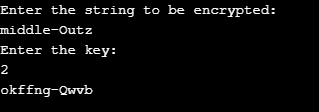

# CaesarCipher
A Go program to implement Caesar's cipher.  
Caesar's cipher shifts each letter by a number of letters. If the shift takes past the end of the alphabet, it just rotates back to the front of the alphabet.

### Problem from HackerRank
For example, the given plain text s = There's-a-starman-waiting-in-the-sky and the alphabet is rotated by k = 3. The encrypted string is Wkhuh'v-d-vwdupdq-zdlwlqj-lq-wkh-vnb.  
Note: The cipher only encrypts letters; symbols, such as -, remain unencrypted.

#### Input format
The first line contains the integer, n, the length of the unencrypted string.
The second line contains the unencrypted string, s, which is a valid ASCII string without spaces
The third line contains k, the number of letters to rotate the alphabet by.

#### Output format
For each test case, it prints the encoded string.

### Test Run

